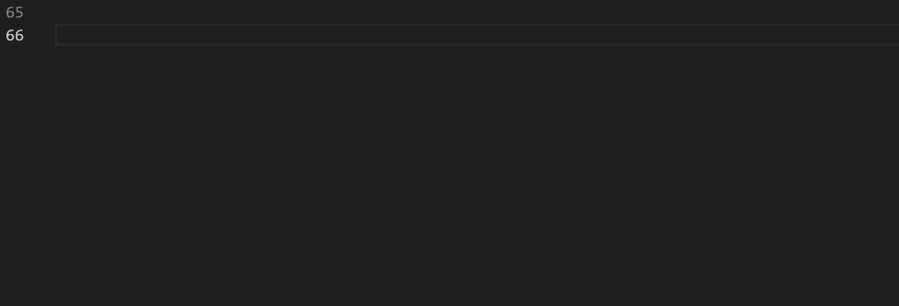
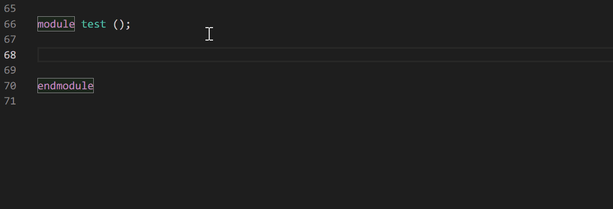
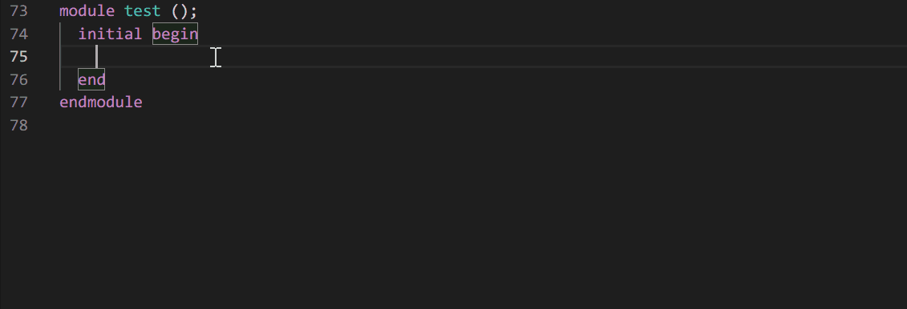
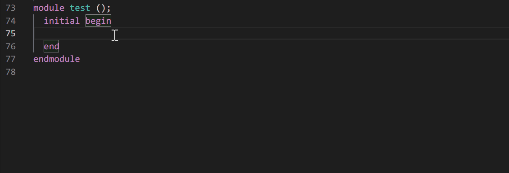

# SystemVerilog Completion

SystemVerilog Completion is a VS Code extension providing automatic word-completion and abbreviation expansion for SystemVerilog.

The SystemVerilog syntax is based on IEEE Std 1800-2017.

## Features

### Keywords Completion

The extension provides keywords completion.

### System Tasks and System Functions Completion

The extension provides utility system tasks and system functions completion, including:

-   Simulation control system tasks, such as `$finish` and `$stop`
-   Conversion system function, such as `$signed` and `$cast`
-   Data query system functions, such as `$bits`
-   Array query system functions, such as `$size`
-   Math system functions, such as `$clog2` and `$pow`
-   Bit vector system functions, such as `$onehot` and `$isunknown`
-   Assertion control system tasks, such as `$assertcontrol`
-   Probability distribution system functions, such as `$random` and `$dist_normal`

The extension provides I/O system tasks and system functions completion, including:

-   Display system tasks, such as `$display` and `$write`
-   File I/O system tasks, such as `$fopen` and `$fwrite`
-   Memory load system tasks, such as `$readmemh` and `$readmemb`
-   Command line I/O system functions, such as `$test$plusargs` and `$value$plusargs`
-   VCD file I/O system tasks, such as `$dumpfile`

### Timing Checks Completion

The extension provides timing checks completion, including `$setup`, `$hold`, etc.

### Compiler Directives Completion

The extension provides compiler directives completion, including `` `define ``, `` `include ``, etc.

## Contributing

Pull requests are welcome. For major changes, please open an issue first to discuss what you would like to change.

## License

[MIT](LICENSE.md)
